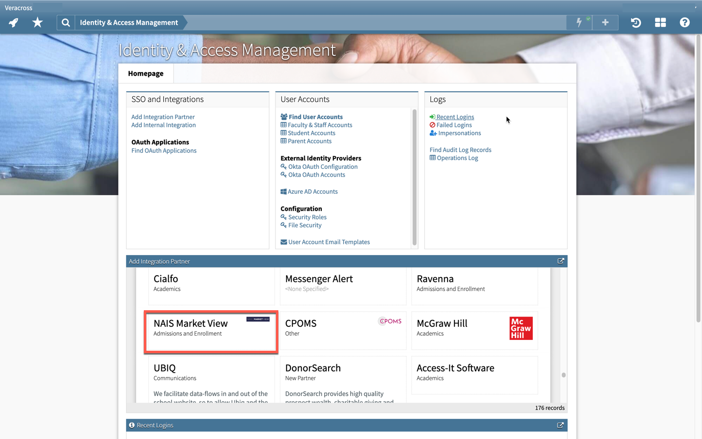

# Sync data from Veracross

## Overview 

### Audience 

This guide is for schools who are [NAIS ](https://www.nais.org)members, and use [Veracross](https://www.veracross.com/) for admissions or application data.&#x20;

After one person at your school completes this process, the integration will work for everyone at your school. Each user should use their own login. Any NAIS member school can have unlimited staff accounts. Add and manage your school's roster at [my.nais.org](https://my.nais.org).

### Goal 

This integration syncs two types of data from Veracross into Market View.

1. Applicants. If it exists, we will sync names, grades, addresses, and student IDs for students who applied to your school. Note: applicants need to have an "application date" to be considered applicants for this process.
2. Enrollments. If it exists, we will sync names, grades, addresses, and student IDs for students who enrolled in your school.


Market View is committed to the highest security of your data. We encrypt all data in transit from your admission software, and any time it is used. We encrypt the data within our database. Your data will never leave our database or be shared. We take data security and privacy extremely seriously.[ Read more about how Market View protects your data. ](../../data-privacy.md)


## Instructions 

### Step 1: Add Market View to Veracross 


This step must be performed by one of your school’s administrators of Veracross, someone with “Oauth\_App\_Admin” permissions. If you aren’t an admin, feel free to forward these instructions to someone who is.\
\
If your admin doesn't see the button to "start integration", they need to go into their permissions and give themselves “Oauth\_App\_Admin” permission.


* [ ] [Log in to Veracross](https://dukope.com/devlogs/papers-please/mobile).
* [ ] Click this link: [https://axiom.veracross.com/#/homepage/iam](https://nam10.safelinks.protection.outlook.com/?url=https%3A%2F%2Faxiom.veracross.com%2F%23%2Fhomepage%2Fiam\&data=05%7C01%7Cwilkinson%40nais.org%7C8cd20913b2ca4e60d5af08da7949459f%7C74658d2af1324bd5adfdb990a6a9cf0f%7C0%7C0%7C637955652870664012%7CUnknown%7CTWFpbGZsb3d8eyJWIjoiMC4wLjAwMDAiLCJQIjoiV2luMzIiLCJBTiI6Ik1haWwiLCJXVCI6Mn0%3D%7C3000%7C%7C%7C\&sdata=RirVx7YzxKYrM7gu%2BKN0EEy8Lq4vUzhHUmBTnFWCFH4%3D\&reserved=0).
* [ ] You should see something like this:

<figure><figcaption></figcaption></figure>

* [ ] Select the card titled “NAIS Market View”.
* [ ] Click "Start Integration".
* [ ] Click the green button at the top "Add application".
* [ ] Keep your Veracross tab open for the next step.

### Step 2: Add Scopes 


Note: this integration doesn't require SSO permissions.


* [ ] Select the following scopes:
  1. admission.applicants:list
  2. admission.applications:list
  3. admission.households:list
  4. alumni.demographics:list
  5. students:list
* [ ] Click the green "Update" button at the top
* [ ] Keep your Veracross tab open, you'll need to copy and paste from this page into Market View.

<figure><figcaption>
Adding scopes in Veracross
</figcaption></figure>

### Step 3: Add Veracross details to Market View 

* [ ] Visit the Veracross connection page in Market View: [https://marketview.nais.org/your-data/veracross/connect](https://marketview.nais.org/your-data/veracross/connect)
* [ ] Click on "Connect to Veracross"
* [ ] Copy and paste your Client ID, Client Secret, and School Route from Veracross.

### Step 4: Connect

* [ ] Click "Connect".
* [ ] Congratulations! Your data is now in Market View.&#x20;

## Next steps

* [ ] Now that your integration is complete, you can sync fresh data from Veracross anytime by clicking the "Sync" button.

## How it works


Below describes what Market View does to import your data.


1. Fetch all historical students, applicants, applications, and applicant households
2. Discard students marked as "applicants" who haven't yet applied (these are usually just prospects)
3. Match each applicant to an application and household
   1. If a matching application or household can't be found, an import failure is created
4. Assign a grade level to each applicant
   1. If a grade level doesn't match our list of accepted grades, an import failure is created
5. Match each student to an applicant
   1. If a matching applicant isn't found (e.g. if the applicant became an import failure), an import failure is created
6. For each applicant, look up or geocode their address
   1. An applicant's corresponding student is also assigned this address
   2. If an address can't be geocoded, the student and the applicant become import failures
7. Applicants are separated by year and saved into corresponding "applications" admissions lists
8. A student can be saved in several "enrollments" admissions lists
   1. A student is saved in the enrollment list for the year of their "entry date", at the grade level from their application ("grade level applied for")
   2. Each year after that, until their "exit date", a student is saved in that year with the next grade level
   3. We assume students are promoted each year, since we don't have grade level information for a student for each year


Get an error? Need more help? Email marketview@nais.org.&#x20;

