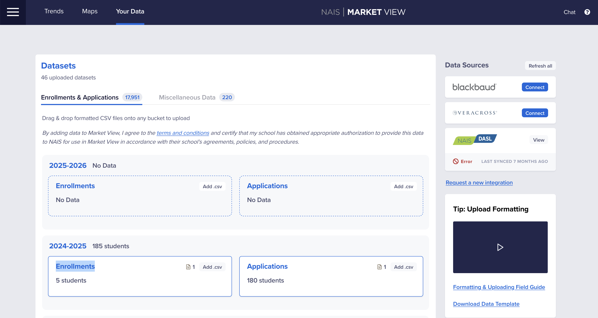

# Deleting spreadsheets

When viewing your admission data, click on the name of the spreadsheet you want to delete.

## Step 1: From "Your Data" page, click the name of the section containing the file you want to delete

<figure><figcaption></figcaption></figure>

## Step 2: Select the file you want to delete

<figure><figcaption></figcaption></figure>

## Step 3: Click the "x" icon

<figure><figcaption></figcaption></figure>
