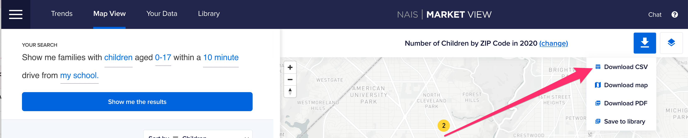

# Download Market View's data

1. From [Map View](https://marketview.nais.org/map), run a query by clicking "Show me the results".
2. Then click "Download CSV"
3. You'll see the spreadsheet contains multiple lines for each ZIP code. This is because Market View provides data for multiple years.&#x20;

<figure><figcaption></figcaption></figure>

