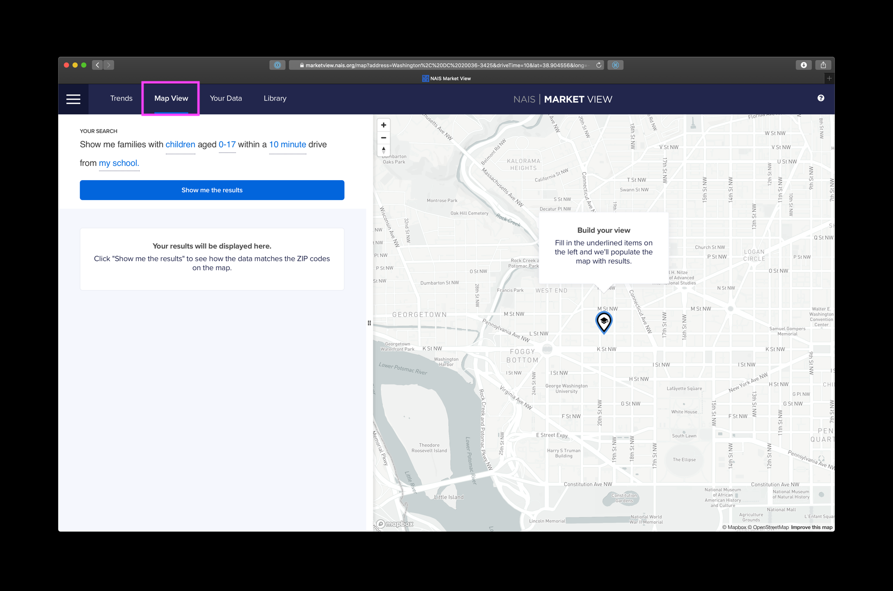
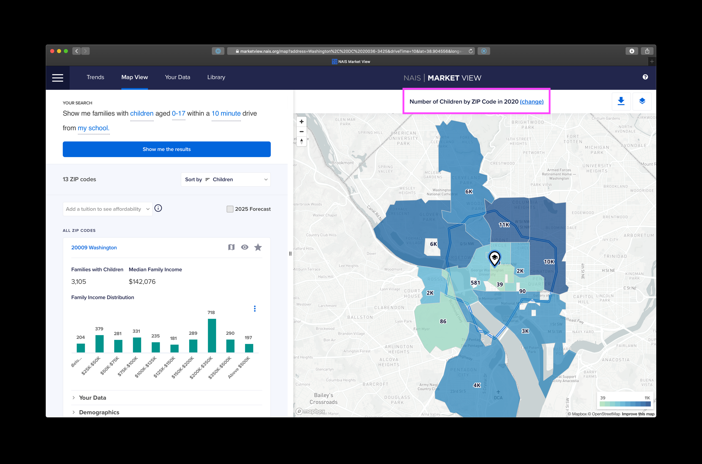
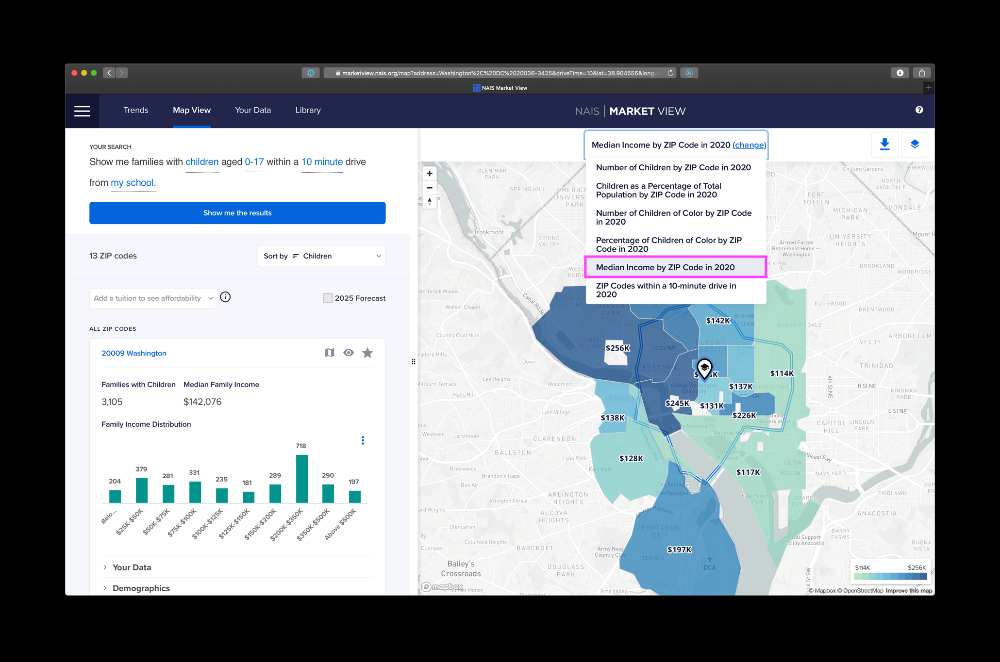
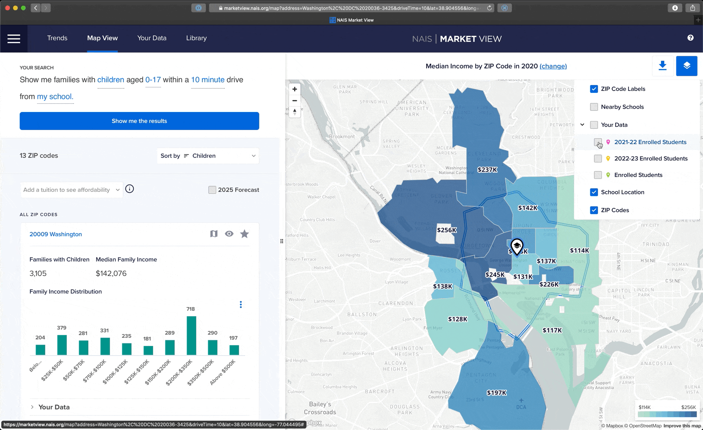
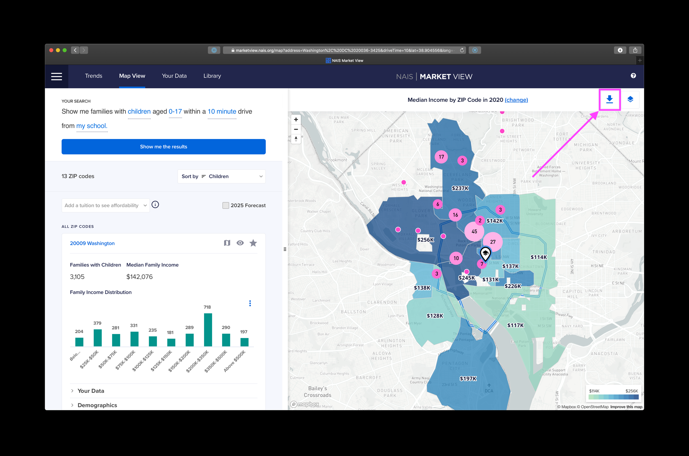
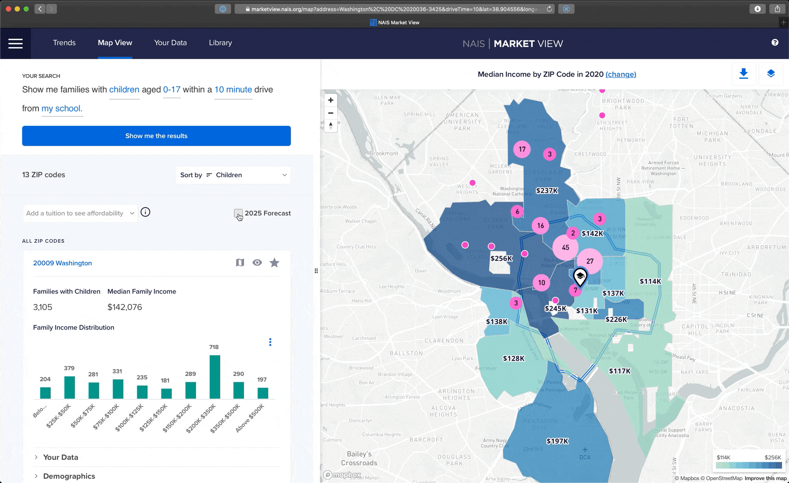

# 2. Analyze your reach

Market View can help you demonstrate what your school's reach looks like now compared to five years from now. Here's how you might show that difference.

 


Click on the images to see them full screen.


At the end of this 10-minute tutorial, you will have artifacts like these two slides.

## Upload Your Addresses

Let's dive into how to create this set of visuals for your school.

We'll start by adding your school's data into Market View. NAIS will never share your addresses, and you can delete them any time.

First, click and download the CSV template below and replace the example data with your school's.&#x20;



The video below (<2 minutes) shows you how to do that.



## Create Your Visuals with Map View

Now that your data is in Market View, let's create your visuals.

First, navigate to the **Map View tab**.

Fill in the underlined items on the left and click **Show me the results**.

### Creating a Visual for the Current Year

Select the type of map you want by clicking **(change)** above the map on the right and select **Median Income by ZIP code in...**

Add your data by selecting clicking the **Map Layers button** and selecting the data you would like to add.

Finally, position the map as you would like and click on the **Download button** and **Download map** to create a screenshot of just the map.&#x20;

That's it! You're done with your school's current reach. Let's work on the 5-year forecast now.

### Create a visual for projections

Click to fill the checkbox for **2025 Forecast** and click download the map for the 2025 forecast.&#x20;

Now that you have your visuals you can insert them into your next presentation. Here's what that looks like for our Acorn School example.

 

​​
