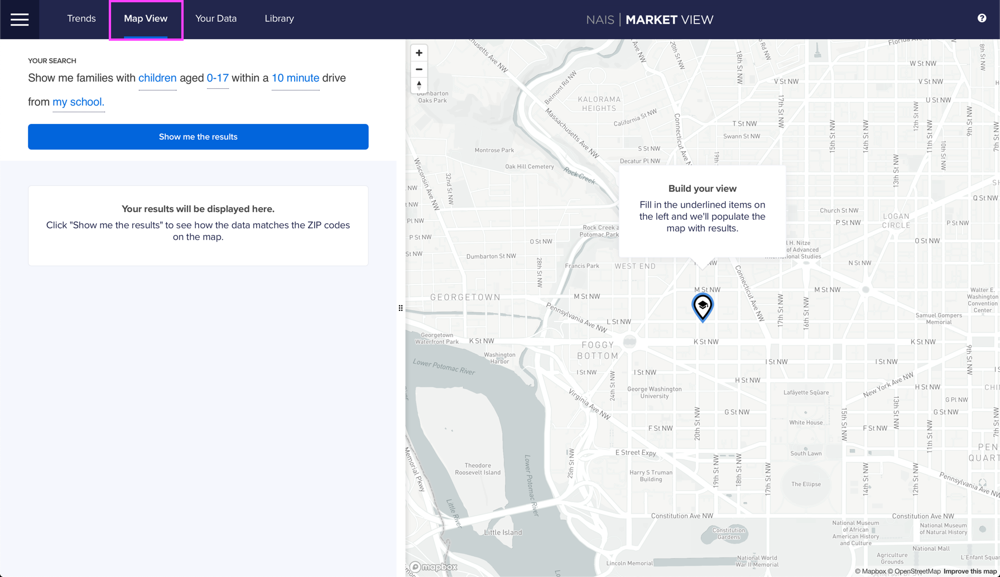
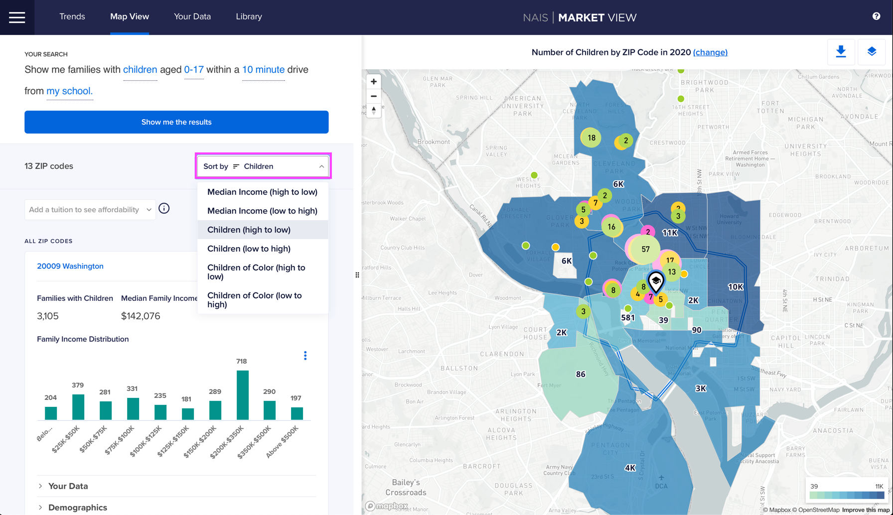
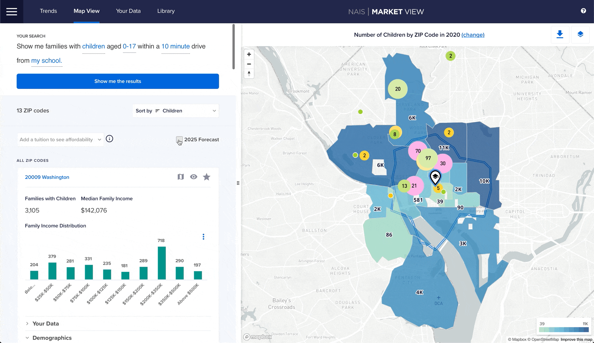

# 3. Find best bet ZIPs

Market View can help you get really specific and look at specific ZIP codes. Here's how we might show that information for our example school.

 

 


Click on the images below to see them full screen.


At the end of this 10-minute tutorial, you will have artifacts like these four slides.

## Getting Detailed Information for Different ZIP Codes in Map View

First, navigate to the **Map View tab**.

Fill in the underlined items on the left and click **Show me the results**. The Map will update based on your search criteria.

## Sort ZIP codes by median income, number of children, and number of children of color

You can **Sort by** median income, number of children, and number of children of color to start refining your search.&#x20;

## Show 5-year Forecast

We can take a look at how the market might change in the next 5 years by clicking the **2025 Forecast** checkbox.

You can get more detailed data by clicking the **Your Data** and **Demographics** accordion toggles.&#x20;

Now that you have the data you're interested in, you can start putting together a slide that tells a data-rich story.&#x20;

Here's an example where we are showing the total addressable market for the 20001 ZIP code and what the numbers for a five-year goal of 0.5% might look like.&#x20;

That's it! You're ready to get detailed data for your school's local market and tell your data story.
