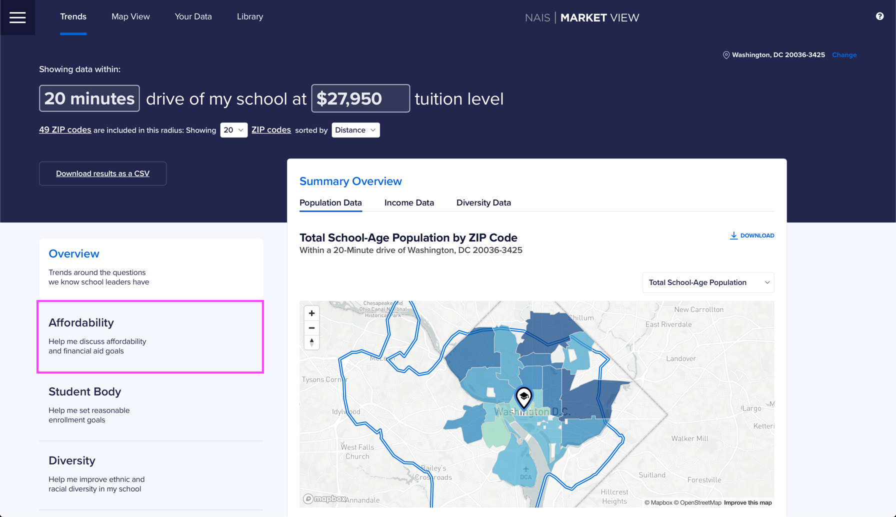

# 4. Forecast changes

Market View can help you identify trends for your local market. For example, let's say we wanted to look at affordability and race/ethnicity. We might want to show the **Change in Average Household Income by Race/Ethnicity** and **Change in School-Aged Population by Race/Ethnicity**.

 

At the end of this 5-minute tutorial, you will have artifacts like these two slides. These are just two examples of the trends you can look at in Market View.

## Looking at **Change in Average Household Income by Race/Ethnicity**

Let's first take a look at the Change in Average Household Income by Race/Ethnicity. We'll go to the **Affordability section** under the Trends tab in Market View.

Next, we'll select **Change in Average**.

We'll download an image of this graph by clicking the **Download button** in the top right.

## Looking at **Change in School-Aged Population by Race/Ethnicity**

Now, let's grab our second graph that shows Change in School-Aged Population by Race/Ethnicity.&#x20;

We'll go to the **Diversity section** under the Trends tab in Market View.

Next, we'll select **Change**.

Finally, we'll download an image of this graph by clicking the **Download button** in the top right.

That's it! We have the two graphs we need for our presentation. We can just drop them into our presentation like this.

 

These are just two of 16 trend graphs available in Market View. Have fun digging into the data and trends for your local market!
