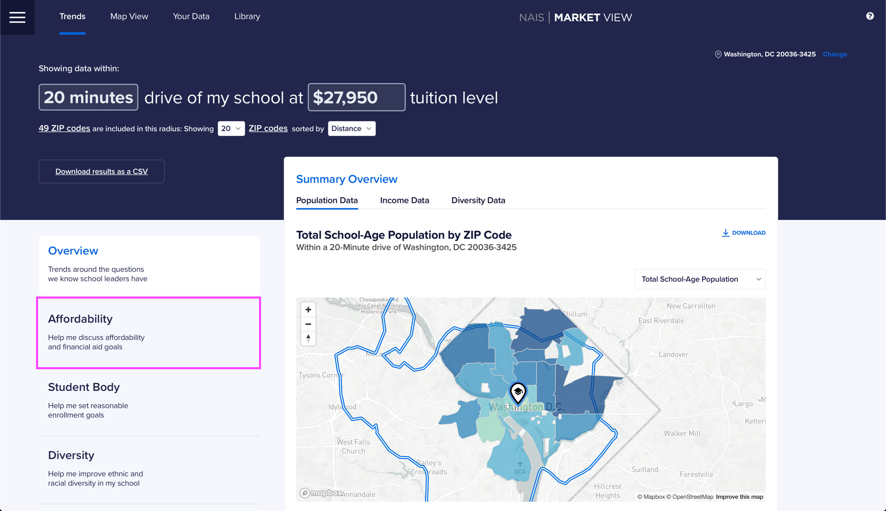
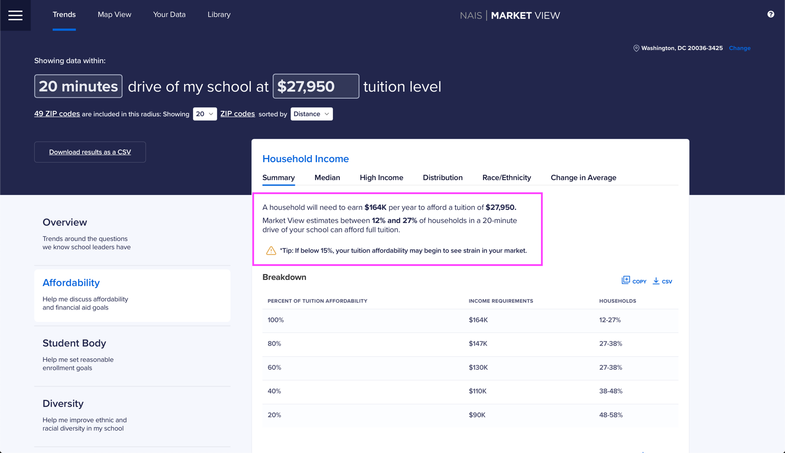
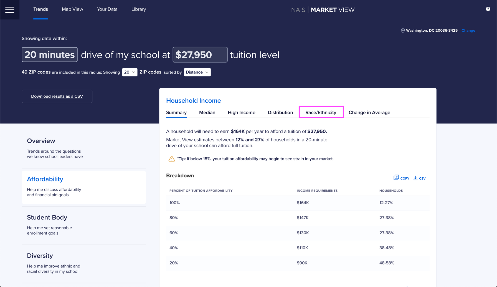
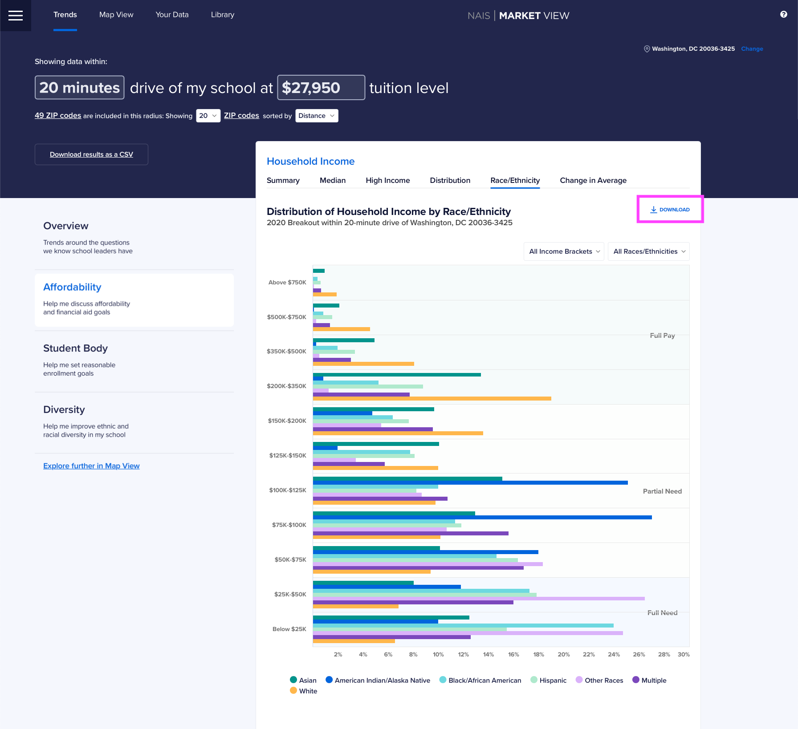

# 5. Assess tuition affordability

Market View can help you make the case for a proposed tuition change. It can help you estimate how many households in your area can afford full tuition.

Here are a few slides for our example school.

 


Click on the images below to see them full screen.


At the end of this 20-minute tutorial, you will have artifacts like these three slides.

## Getting Your Affordability Posture

First, let's get our affordability posture.&#x20;

We'll navigate to the **Affordability section**.

On the Summary tab, Market View gives us an estimate of how many households can afford full tuition. We can copy and paste this into presentation to create our first slide.&#x20;

## Looking at Race/Ethnicity Household Income Distribution

Next, we want to look at the distribution of household income by race/ethnicity.&#x20;

We'll click on the **Race/Ethnicity** **tab**.


You can filter by income brackets and race/ethnicity by checking and unchecking the options in the respective dropdowns in the top right corner of the graph.


You can download the graph by clicking the **Download** **button**. Now, you can add that image to your presentation.

